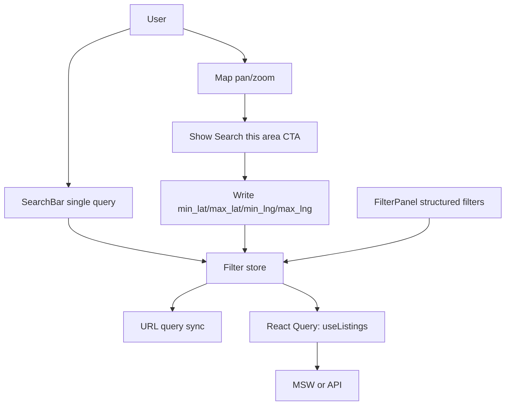

# Frontend UX Refresh (Search, Map, Auth, Profiles) — Design Spec

**Date:** 2026-04-22  
**Scope:** `frontend/` only (API integration is planned for 2026-04-28).  
**Deployment target (later):** Railway (Docker) — not part of this sprint’s implementation work.

## Goals

- Make **search always visible and obvious** on the listings experience across **grid / list / map** views, with a mobile-friendly sticky pattern.
- Keep **filters** powerful, but **remove all neighborhood *feature UI*** (no neighborhood browse pages, no neighborhood chips, no “pick neighborhood” flows).
- Replace price “bubble presets” with a **min/max + range control** (slider is the primary affordance; inputs are the source of truth).
- Update **Home Type / Property type** to **card/box** selection in the filter panel; keep **beds/baths** as numeric selectors; convert **Furnishing** to **toggle/segmented** controls.
- **Map view:** use **plain markers** (no on-pin price text); add **“Search this area”** to apply **bounding box** filters to listing queries; defer clustering/price-labeled markers.
- **Auth:** Sign in gets **email/password** + a visible **Sign in with Google** button that is explicitly **“coming soon”** (toast).  
  **Sign up** collects **first name, last name, email, password, confirm password** and removes **role selection** (no renter/owner/agent UI; default is handled in client payload / mock API).
- **Profiles:** implement **public agent profile** and improve **account settings** using **MSW** handlers shaped like real endpoints so backend wiring is mostly a swap of base URL.
- **Theme:** keep palette **token-driven** in CSS variables (today in `app/globals.css`) and structure work so a future palette is a small token edit (no broad hard-coded colors in components).
- **Remove neighborhood** end-to-end in the **frontend** (search + marketing surfaces + create-listing location step), with routes removed or redirected to `/apartments`.

## Non-Goals (This Sprint)

- Real **Google OAuth** flows.
- **Backend** changes / production API contract finalization.
- **Marker clustering** and **price-on-map** UI.
- “Perfect” final typography overhaul beyond what’s needed to match the new UI components.

## Current Code Anchors (As-Is)

- Listings + views: `components/search/SearchPageClient.tsx`, `app/(public)/apartments/page.tsx`
- Search UI: `components/search/SearchBar.tsx`, `components/search/FilterPanel.tsx`
- Map: `components/map/SearchMap.tsx` (Leaflet)
- State + URL: `lib/stores/filterStore.ts` (includes `neighborhood` + bbox fields today)
- MSW: `msw/handlers.ts` (still filters by `neighborhood=...`)
- Public neighborhood browsing: `app/(public)/neighborhoods/*` + nav/footer links
- Auth UI: `app/(auth)/login/page.tsx`, `app/(auth)/register/page.tsx`
- Validation: `lib/validations/listingSchema.ts` (auth + listing form)

## Proposed Product Behavior

### Search + Filters (Discovery)

- **SearchBar becomes a single primary query** for “everything by text” (including neighborhood names, landmarks, and titles).  
  - Remove the two-field (Location + Search) pattern and any curated **neighborhood suggestion list** (`KTM_NEIGHBORHOODS` usage in search UI should disappear).
- **Filter panel remains** for structured constraints (type, price range, beds/baths, furnishing, feature toggles, etc.).
- **URL remains the source of truth** for shareable state (as today), but `neighborhood` is removed as a first-class param.

### Map View (Bounding Box + “Search this area”)

- On map pan/zoom, **do not** continuously rewrite bbox query params.
- When the user stops moving the map, show a **“Search this area”** CTA. Clicking it:
  - writes `min_lat`, `max_lat`, `min_lng`, `max_lng` (names already reserved in `ListingFilters`)
  - triggers a refetch via existing `useListings` query key
  - updates URL (existing `SearchPageClient` sync)
- If bbox is active, the UI should show a small **“Clear map area”** action (resets the four bbox fields + removes them from the URL).

### Listings / Marketing Surfaces: Remove Neighborhood Feature

- Remove `/neighborhoods` and `/neighborhoods/[slug]` as user-facing features:
  - Prefer **Next redirects** in `next.config.ts` to `/apartments` (or `/`) for backwards compatibility and any bookmarked links.
- Remove “Neighborhoods” navigation and footer quick links (`components/layout/Navbar.tsx`, `components/layout/Footer.tsx`).
- Update `app/(public)/page.tsx` to remove `getNeighborhoods()`-driven “browse neighborhoods” sections and any `KTM_NEIGHBORHOODS` slices.

### Create Listing: Replace Neighborhood Picker with Map Pin

- Remove the neighborhood chooser in `components/listings/ListingForm/Step2Location.tsx`.
- Add a **map pin selector** to choose coordinates (Leaflet, consistent with the rest of the app’s map stack).
- Persist coordinates into the form state and payload:
  - Preferred shape: `ListingLocation` fields (`latitude`/`longitude`) alongside `address_line` and other address fields, **without** `neighborhood_id` in the client payload for now.
- Validation updates:
  - Remove `neighborhood_id` as a hard requirement in `step1Schema` (it is currently out-of-place vs UI anyway).
  - Add numeric validation for coordinates and require them for the step (unless product wants optional pin — default here is **required** because user chose map pin).

### Auth Pages

- **Login**
  - Add a secondary button **Continue with Google** (disabled or enabled-but-toasts).
  - On click: `toast.info("Google sign-in is coming soon")` (exact string can be product-edited).
- **Register**
  - Remove role grid UI and remove `role` from user-facing form.
  - Add `first_name` + `last_name` fields.
  - Update `registerSchema` to validate names.
  - Update API surface used by the app:
    - `register()` in `lib/api/client.ts` should accept a structured payload (not only `email/password`) so the UI and MSW are aligned.
    - `useRegister()` should pass the full object.
    - MSW `POST /api/v1/auth/register` should accept and ignore extra fields (or echo them) while preserving existing test behaviors.

### Profiles (MSW-shaped)

#### Public profile (`/agents/:id` today)

- Adopt a mocked endpoint: **`GET /api/v1/users/{user_id}`** returning a public-safe projection:
  - `id`, display name, role (optional), `profile` (bio/avatar/phone as appropriate), and maybe listing count.
- The page `app/(public)/agents/[slug]/page.tsx` should become a real client or server component that fetches and renders, not a static placeholder.
- The agents index page can remain static for now, but should not rely on “neighborhood strings” as a feature (rename copy to “service areas / coverage” as plain text, not linked browsing).

#### Logged-in account settings (`/dashboard/settings`)

- Continue using `GET /api/v1/auth/me` for core identity, but add UI blocks that are plausibly backed later:
  - name fields, avatar, contact methods, etc. (at minimum: show `profile.first_name/last_name` if present; otherwise show placeholders)
- “Change password” can remain a stub with toast until backend is ready.

## Architecture Options (Choose One)

### Option A — Minimal Patch (Fastest, Highest Drift)

- Tweak `SearchPageClient` + `SearchBar` in-place, add bbox logic in `SearchMap` without extracting components.

**Trade-offs:** fastest, but the listings screen is already structurally complex and will get harder to maintain.

### Option B — “Search Shell” Extraction (Recommended)

- Create a small `SearchShell` (name can differ) that owns:
  - sticky header (search + sort + view toggle + mobile filter entry)
  - the responsive layout (sidebar filter + results/map)
- Keep `useFilterStore` and URL sync mostly unchanged, but make URL parsing/serialization a dedicated helper to reduce `SearchPageClient` size.

**Trade-offs:** slightly more up-front work, but matches the “priority page” and upcoming iterations.

### Option C — Feature Module Split

- Move search/map code into `features/search/*` with explicit exports, stories/tests co-located.

**Trade-offs:** best long-term, most churn in a large repo; likely overkill for this single sprint.

**Recommendation:** **Option B**. It’s the best balance of clarity and scope for a “priority page” that will keep evolving.

## Design Details (Implementation-Oriented)

### Search Header Layout (Desktop + Mobile)

- **Desktop:** show **large** `SearchBar` above the “results header” row (title/sort/view toggle). Use **sticky** positioning within the page scroll container so it remains visible while browsing results and when switching views.
- **Mobile:** `SearchBar` should be `sm` on narrow screens, but still **stick** (top offset should account for any fixed navbar; use `top-*` with existing layout, avoid double-sticky bugs).

### Filter Panel

- **Remove** Neighborhood section entirely; remove any `toggleNeighborhood` store API once unused.
- **Property Type / Home Type:** convert chip row into a **2-column grid of bordered cards** (simple, not “glossy marketing cards”):
  - clear selected state: border + quiet background
  - icon optional (prefer minimal; avoid emoji-heavy UI in filters unless already established elsewhere)
- **Price:** remove preset bubble row. Replace with:
  - a dual-thumb slider (`@radix-ui/react-slider`, already used in the legacy Vite `client/`)
  - min/max number inputs; slider and inputs **stay in sync** (clamping + min ≤ max)
  - a subtle optional bar chart/background is **optional**; do not add fake charts unless you render real price buckets later
- **Beds + Baths:** add **baths** as a second row matching the bed control pattern (store already supports `bathrooms`).
- **Furnishing:** change from radio list to a **3-option segmented/toggle** control.
- **Feature toggles** remain, but should follow the product rule: not overly “pill / toy UI” (keep functional).

### Map Markers

- Markers should remain default Leaflet markers; price appears only in popups (already true), and there must be no separate price label element on the map.

### Theming / Token Swap Readiness

- Centralize in `:root` variables in `app/globals.css` and ensure components use semantic tokens:
  - `bg-background`, `text-foreground`, `border-border`, `bg-card`, and `text-accent` / `bg-accent`
- Add a small `theme` note at top of the stylesheet describing “swap tokens here” (no new docs elsewhere).

## MSW + Mock Data Updates (Must Stay Consistent)

- **Listings filter:** update `filterListingItems` to:
  - remove `neighborhood` param behavior
  - add simple `search` text matching across title + address-like fields in mock items (where available)
  - add bbox filtering if mock items include lat/lng (or derive from existing mock locations)
- **Neighborhood endpoints:** either remove handlers or return **410/empty**—prefer removing to catch accidental client usage during dev.
- **Users endpoint:** add `GET /api/v1/users/:id` returning deterministic mock data for the IDs used in `/agents` cards.
- **Auth register:** accept `{ email, password, first_name, last_name }` (and optionally `role: "renter"` as default) without breaking current tests.

## Test Plan (Frontend)

- Update unit tests:
  - `__tests__/unit/components/SearchBar.test.tsx` (new single-field behavior)
  - `__tests__/unit/components/FilterPanel.test.tsx` (no neighborhood, slider present)
  - store tests `__tests__/integration/stores/filterStore.test.ts` (neighborhood removed)
- Update e2e:
  - remove/replace `__tests__/e2e/neighborhoods.spec.ts`
  - ensure `search-filters.spec.ts` and `map` flows still pass with bbox button behavior

## Mermaid: Search/Map/URL Flow

## Open Points / Week-2 Backend Checklist (Not Blockers for UI)

- Final REST contract for:
  - bbox filters (`min_lat` etc.)
  - register payload (names + default role)
  - public user profile response shape
  - create listing with lat/lng without `neighborhood_id`

## Rollout

- Land UI + MSW + tests in one coherent PR.
- Manually verify `/apartments` grid/list/map + auth pages + agent profile in dev.
- On 2026-04-28, replace MSW with live API in `lib/api/client.ts` (environment switch), then validate Railway deploy path separately.
